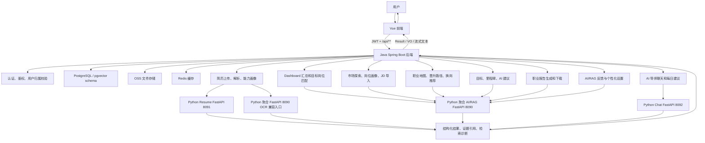
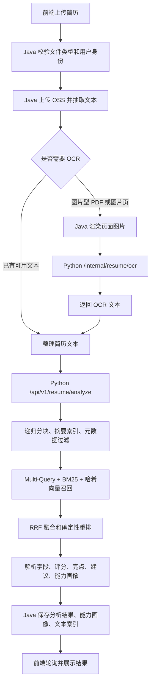
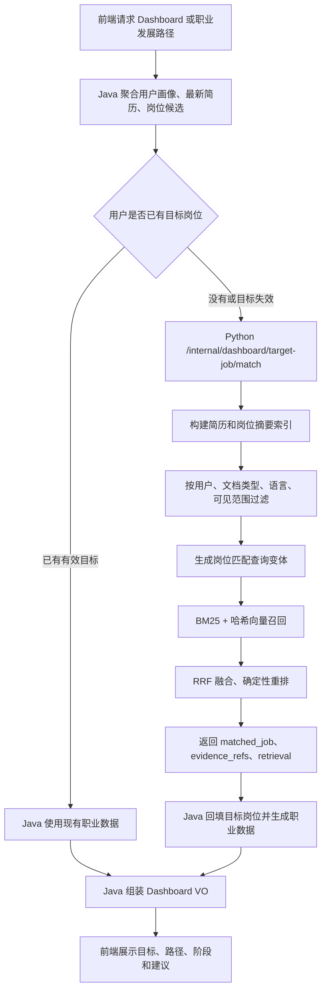
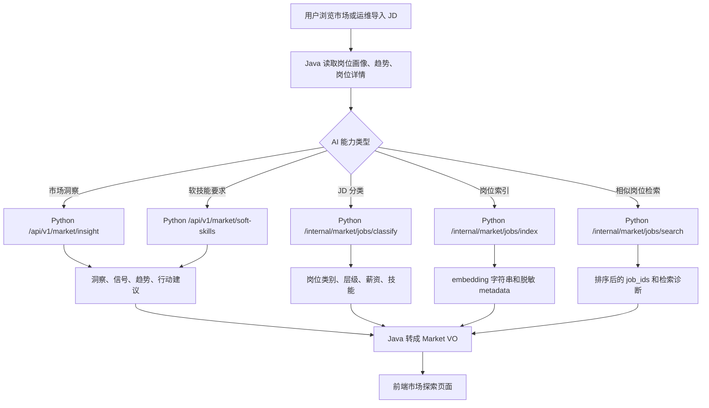
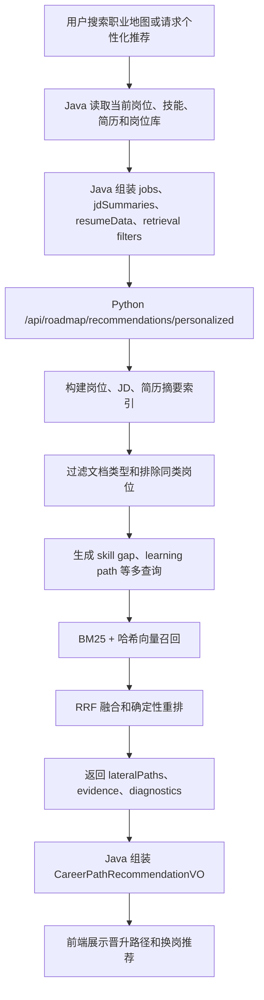
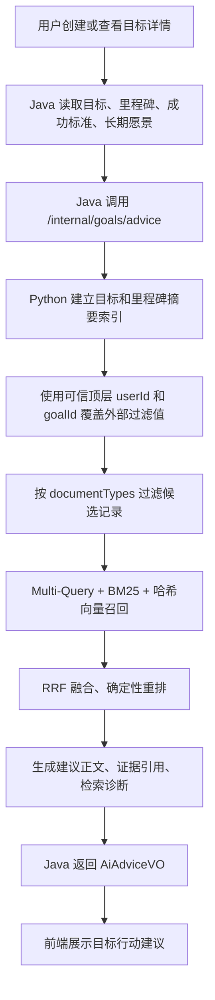
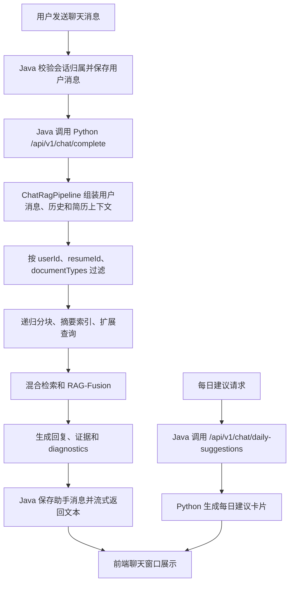
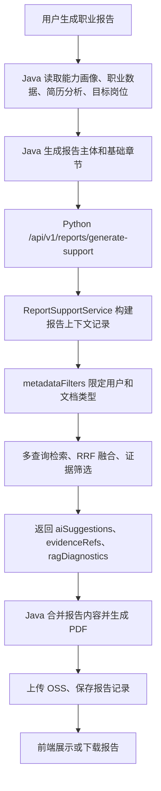
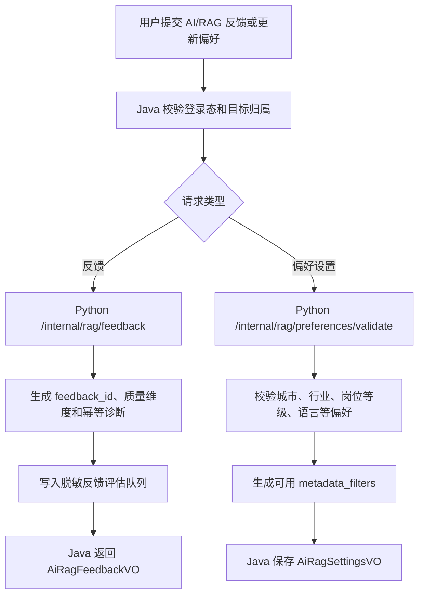
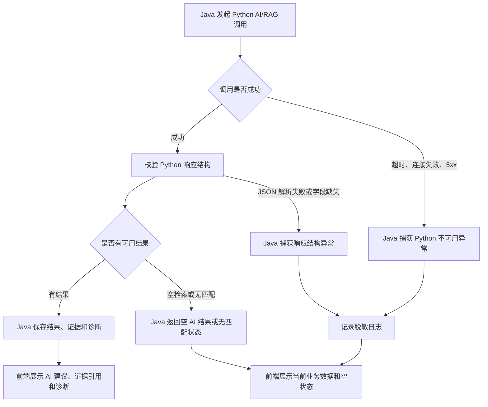

# AI-University-Student-Career-Planning

本项目是面向大学生职业规划的前后端系统。前端使用 Vue 3，业务后端使用 Java/Spring Boot，AI/RAG 能力统一放在 Python 服务中。浏览器只访问 Java 后端，Java 负责认证、业务编排、文件处理、数据库读写和统一响应；Python 负责简历分析、OCR、岗位检索、RAG 生成、AI 建议和诊断信息。

## 关联笔记库

本项目的 AI Agent、RAG、FastAPI 服务边界和 Python 化改造思路，关联到 Obsidian 学习笔记仓库：[HeWhenJay/obsidian-study-notes](https://github.com/HeWhenJay/obsidian-study-notes)。

笔记仓库中与本项目直接相关的记录主要位于 `项目使用记录/AI-University-Student-Career-Planning/`，用于沉淀本项目的 AI/RAG 迁移、接口设计、流程图说明、失败场景分析和后续优化记录。

## 当前架构

| 层级 | 技术 | 说明 |
| --- | --- | --- |
| 前端 | Vue 3、Vite、TypeScript、Pinia、Vue Router、Axios | 位于 `website/`，通过 `/api/**` 调用 Java 后端 |
| Java 后端 | Spring Boot 4、MyBatis、Redis、PostgreSQL、OSS | 位于 `server/`、`common/`、`pojo/`，对前端提供唯一 API 入口 |
| Python AI 服务 | FastAPI、确定性 RAG 降级实现、OCR/分析服务 | 位于 `ai-service/`，只供 Java 在本机 HTTP 调用 |
| 数据库 | PostgreSQL + pgvector schema | 初始化脚本位于 `database/` |

## 业务总流程图



总流程的核心原则是：浏览器只访问 Java 后端；Java 负责鉴权、业务编排、文件、数据库、缓存和统一响应；Python 只通过本机 HTTP 暴露 FastAPI 接口给 Java 调用，负责 OCR、简历分析、检索、RAG 建议、证据引用和诊断信息。Python 当前实现为确定性降级 RAG：递归分块、摘要索引、元数据过滤、多查询扩展、BM25、哈希向量风格召回、RRF/RAG-Fusion、确定性重排和脱敏诊断。

## AI 业务处理流程

### 1. 简历 AI 分析与 OCR



处理方式：

- Java 只处理文件接收、归属校验、OSS、PDF 渲染和数据库状态，不在 Java 内做新的 AI 分析。
- OCR 通过 `POST /internal/resume/ocr` 调用 Python，真实模型需要配置 OCR API key；本地测试可以用 `FUCHUANG_RESUME_OCR_MOCK_TEXT`。
- 简历结构化分析通过 `POST /api/v1/resume/analyze` 调用 `career_ai.resume_analysis_service:app`。
- Python 先按章节、段落和长度做递归分块，再建立文档级和章节级摘要索引，并按 `user_id`、`vector_store_id`、`document_type`、`visibility` 过滤。
- Python 返回 `parsed_data`、`scores`、`highlights`、`suggestions`、`capability_profile` 和 `rag_diagnostics`；Java 将结果落库为简历分析、能力画像和向量文本索引。

### 2. Dashboard 目标岗位匹配



处理方式：

- Java 通过 `PythonDashboardAiClient` 调用 `POST /internal/dashboard/target-job/match`，请求中包含用户身份、简历摘要、候选岗位和过滤条件。
- Python 将简历和岗位都转成摘要索引，先做元数据过滤，再做多查询召回和 RRF 融合，避免把不属于当前用户或不可见范围的证据用于匹配。
- 如果匹配成功，Python 返回目标岗位、匹配分、证据引用和检索诊断；Java 再校验岗位是否真实存在，并创建或回填用户职业数据。
- 如果匹配失败或 Python 不可用，Java 不伪造 AI 结论，而是返回当前可用的 Dashboard 数据和空匹配状态。

### 3. 市场探索、岗位画像与 JD 处理



处理方式：

- Java 负责岗位基础数据、分页、详情、导入 Excel 和统一响应；AI 洞察、JD 分类、索引和检索都交给 Python 聚合服务。
- 市场洞察和软技能生成用于前端市场探索展示；Python 返回结构化字段，Java 不在本地生成静态 AI 文案。
- JD 分类把招聘文本转成岗位类别、层级、薪资范围和技能标签，便于写入岗位表。
- 岗位索引接口返回可落库的 metadata 与确定性 embedding 字符串；岗位检索接口对 Java 提供的候选岗位做混合检索和 RRF 排序。
- Python 侧会丢弃 `raw_text` 等不应进入诊断或索引 metadata 的字段，避免敏感 JD 原文泄漏。

### 4. 职业地图与路线推荐



处理方式：

- Java 仍负责职业地图的普通搜索、节点详情、图谱和缓存；个性化推荐由 Python Roadmap RAG 生成。
- Python 使用岗位、JD 摘要和简历白名单字段构建索引，不把姓名、学校、公司、电话、邮箱、API key 等敏感内容放进查询变体或诊断。
- `excludeSameCategory`、`documentTypes` 等过滤条件会在 Python 侧实际参与候选集筛选，保证换岗推荐不会退化为同类岗位重复推荐。
- Python 返回横向路径、证据和诊断；Java 将它包装成前端需要的 `CareerPathRecommendationVO`。

### 5. 目标管理 AI 建议



处理方式：

- Java 提供目标、里程碑和成功标准的增删改查；AI 建议通过 `PythonGoalsAdviceClient` 调用 Python。
- Python 只信任 Java 顶层传入的 `userId` 和目标 ID，防止请求体里的过滤条件覆盖真实用户身份。
- Python 依据目标、里程碑、成功标准构建可检索摘要，并根据文档类型过滤证据来源。
- 返回内容包括建议正文、证据引用和诊断；敏感手机号、邮箱、模型密钥和嵌套原文不会出现在返回结果中。

### 6. AI 导师聊天与每日建议



处理方式：

- Java 负责会话、消息、附件和流式响应，保证用户只能访问自己的会话。
- Python Chat 通过 `ChatRagPipeline` 处理内容生成：输入包括当前消息、可选简历 ID、解析后的技能和目标岗位、历史消息以及检索过滤条件。
- 检索结果会返回 `evidence` 和 `diagnostics`，用于解释回复依据和后续质量评估。
- 每日建议走独立接口，输出结构化建议，Java 再转为 `ChatDailySuggestionsVO` 给前端。

### 7. 职业报告 AI 支持



处理方式：

- Java 负责报告生命周期：读取业务数据、创建报告记录、生成 PDF、上传 OSS、下载和删除。
- Python Reports RAG 只补充 AI 建议、证据引用和诊断，不负责数据库和 PDF。
- 如果 Python 不可用或空检索，Java 返回空 AI 建议和诊断状态，不在 Java 本地生成伪 AI 建议。
- Python 会对证据片段做脱敏，避免手机号、邮箱、身份证等敏感内容进入报告诊断。

### 8. AI/RAG 反馈与个性化设置



处理方式：

- Java 保证反馈对象属于当前用户，避免用户评价或修改他人的 AI 结果。
- Python 反馈接口按 `request_id` 做幂等处理，并把反馈写入本地评估队列，供后续检索质量分析使用。
- Python 偏好校验接口把用户偏好转成安全的 metadata 过滤条件，供后续 RAG 查询使用。
- 反馈队列和诊断信息不得记录 JWT、OSS 签名 URL、API key 或原始敏感简历正文。

## AI 失败场景与降级处理



通用失败原则：

- 前端只接收 Java 的统一响应，不直接感知 Python 端口和内部异常。
- Java 调用 Python 时会区分校验失败、超时、不可用、HTTP 错误、JSON 解析失败和响应结构错误。
- Python 不可用时，Java 不在本地编造 AI 内容；能返回业务基础数据的接口继续返回基础数据，不能完成的异步任务会标记失败或返回空 AI 状态。
- 日志和诊断必须脱敏，不写入原始简历、原始 JD、JWT、OSS 签名 URL、API key、手机号、邮箱等敏感信息。
- 空检索、无匹配和模型不可用不是同一类失败：空检索表示流程可运行但没有证据；无匹配表示候选不足或分数不达标；不可用表示 Python 或外部模型链路失败。

### 分业务可能失败点

| AI 业务 | 可能失败的情况 | 当前处理方式 |
| --- | --- | --- |
| 简历上传与解析 | 文件类型不支持、文件为空、OSS 上传失败、PDF 渲染失败、文本抽取为空 | Java 拒绝请求或把分析状态置为失败；前端通过分析状态看到失败原因 |
| 简历 OCR | OCR API key 未配置、外部 OCR 超时、模型返回非预期结构、图片 data URL 不合法 | Python 返回 `OCR_API_KEY_MISSING`、`OCR_UNAVAILABLE`、`OCR_INVALID_RESPONSE` 或 `VALIDATION_ERROR`；Java 不伪造 OCR 文本 |
| 简历结构化分析 | `vector_store_id`、`user_id`、`resume_text` 缺失，简历文本过短或无有效字段 | Python 返回校验错误；Java 保留失败状态，不写入虚假的能力画像 |
| Dashboard 目标岗位匹配 | 用户没有可用简历、岗位候选为空、过滤条件排除所有岗位、Python 返回 `NO_MATCH` | Java 返回当前 Dashboard 基础数据；无法自动创建职业路径时给出空路径或无目标状态 |
| 市场洞察和软技能 | 岗位画像不存在、岗位技能为空、Python 不可用、响应字段不符合 Market VO | Java 跳过 AI 洞察缓存或返回空洞察状态，不生成静态 AI 文案 |
| JD 分类与岗位索引 | 招聘文本为空、薪资格式异常、岗位类别无法识别、metadata 含敏感原文 | Python 走确定性分类和清洗；无法分类时返回校验或默认空结果，敏感 metadata 不入库 |
| 岗位相似检索 | 候选岗位为空、查询为空、Python 检索失败 | Java 可回退到关键词检索或返回空列表；不会把失败包装成高置信推荐 |
| Roadmap 个性化推荐 | 当前岗位缺失、岗位库为空、过滤条件只允许不可用文档、推荐分数类型异常 | Python 返回空 `lateralPaths` 或校验错误；Java 返回空推荐诊断，不用 Java 本地相似度补足 |
| 目标 AI 建议 | 目标不存在、目标不属于当前用户、里程碑为空、请求体过滤条件试图覆盖用户身份 | Java 先做归属校验；Python 使用可信顶层 `userId` 和目标 ID；候选不足时返回低证据或空建议 |
| AI 聊天 | 会话不属于当前用户、消息为空、Python Chat 超时、流式响应中断、检索证据为空 | Java 拒绝越权会话；Python 返回可用回复或空证据诊断；流式中断时前端只展示已收到内容或错误状态 |
| 每日建议 | 用户没有简历或目标信息、Python 返回空建议 | Java 返回空建议卡片或默认业务状态，不编造个性化结论 |
| 职业报告 AI 支持 | 能力画像缺失、报告上下文不足、Python Reports RAG 空检索、PDF 生成失败、OSS 上传失败 | Java 可生成基础报告；AI 建议为空时记录诊断；PDF 或 OSS 失败则报告生成失败 |
| AI/RAG 反馈 | 反馈目标不属于当前用户、评分不合法、重复提交、反馈队列文件不可写 | Java 做归属校验；Python 校验评分并按 `request_id` 幂等；队列失败时返回内部错误 |
| 个性化设置 | 城市、行业、岗位等级或语言偏好不合法 | Python 过滤无效值并返回可用 `metadata_filters`；Java 只保存校验后的设置 |

### 失败对用户体验的影响

- 业务基础功能优先可用：登录、资料、岗位列表、目标列表、报告记录等不依赖 Python 的基础接口应继续工作。
- AI 增强结果可为空：AI 建议、证据引用、诊断、市场洞察、个性化推荐可以返回空状态，由前端显示“暂无 AI 结果”一类状态。
- 异步任务要可追踪：简历解析和报告生成这类链路如果失败，应落到 `failed` 或等价状态，避免前端无限轮询。
- 安全优先于召回：如果用户归属、文档可见范围或 metadata 过滤不确定，宁可返回空结果，也不跨用户使用证据。
- 诊断只服务开发和解释：诊断信息用于排查检索和生成质量，不应包含原始敏感文本，也不应作为前端唯一业务数据来源。

## 主要功能

- 用户注册、登录、资料编辑和 JWT 鉴权。
- 简历上传、文本抽取、图片型 PDF OCR、简历结构化分析、能力画像和预览。
- Dashboard 汇总、目标岗位匹配、职业发展路径自动创建和当前阶段更新。
- 市场探索、岗位画像、热门岗位、市场洞察和岗位详情。
- 职业地图搜索、岗位图谱、岗位详情、晋升路径和换岗推荐。
- 目标管理、里程碑管理和目标 AI 建议。
- AI 导师聊天、会话管理、流式回复、每日建议、附件上传和语音入口。
- 职业报告生成、详情、编辑、下载和删除。
- AI/RAG 反馈与个性化设置闭环。

## 服务端口

| 服务 | 默认地址 | 说明 |
| --- | --- | --- |
| Java 后端 | `http://127.0.0.1:8081` | 前端唯一业务入口 |
| Python 聚合 AI/RAG 服务 | `http://127.0.0.1:8090` | 报告、目标、Dashboard、Roadmap、Market/JD、RAG 反馈 |
| Python Resume 服务 | `http://127.0.0.1:8091` | 简历分析与 OCR 独立服务 |
| Python Chat 服务 | `http://127.0.0.1:8092` | 聊天回复与每日建议 |
| Vue 前端 | `http://127.0.0.1:5173` | 本地开发服务 |

## 本地启动

安装 Python 依赖：

```powershell
python -m pip install -r ai-service/requirements.txt
```

启动 Python 聚合 AI/RAG 服务：

```powershell
$env:PYTHONPATH='ai-service'
$env:AI_SERVICE_PORT='8090'
python -m uvicorn app.main:app --host 127.0.0.1 --port 8090
```

启动 Python Resume 服务：

```powershell
$env:PYTHONPATH='ai-service'
python -m uvicorn career_ai.resume_analysis_service:app --host 127.0.0.1 --port 8091
```

启动 Python Chat 服务：

```powershell
$env:PYTHONPATH='ai-service'
$env:AI_SERVICE_PORT='8092'
python -m uvicorn app.main:app --host 127.0.0.1 --port 8092
```

启动 Java 后端：

```powershell
mvn -pl server -am spring-boot:run
```

启动前端：

```powershell
cd website
npm install
npm run dev
```

## 验证命令

```powershell
$env:PYTHONPATH='ai-service'
python -B -m pytest ai-service/tests -q -p no:cacheprovider
```

```powershell
mvn -pl server -am test
```

```powershell
cd website
npm run build
```

## 文档索引

- Python AI 服务说明：[ai-service/README.md](ai-service/README.md)
- 部署说明：[deploy/README.md](deploy/README.md)
- AI/RAG 配置与端口：[docs/AI_RAG_配置与端口说明.md](docs/AI_RAG_配置与端口说明.md)
- 业务流程图：[docs/business-flow.mmd](docs/business-flow.mmd)
- 接口文档：[接口文档/](接口文档)
- 关联 Obsidian 笔记库：[HeWhenJay/obsidian-study-notes](https://github.com/HeWhenJay/obsidian-study-notes)

当前仓库只保留与现有代码一致的说明文档和接口文档。历史待办清单、旧迁移备忘和重复部署说明已清理。
