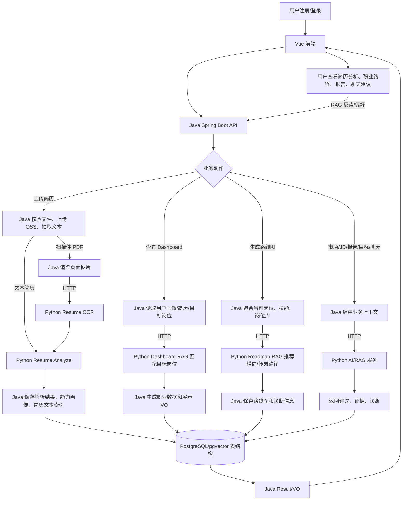

# AI-University-Student-Career-Planning

面向大学生职业规划的前后端项目。前端使用 Vue，业务后端使用 Java/Spring Boot，AI/RAG 能力统一通过 Python 服务提供。Java 只负责认证、业务编排、文件处理、数据库读写和接口返回，不再内嵌 OpenAI/Spring AI 模型调用、向量检索、RAG 生成或本地推荐补足逻辑。

## 本轮提交说明

本地领先 `origin/master` 的 3 个提交均有作用，属于同一轮“Java AI 实现迁移到 Python 边界”的连续改动，建议保留并合并为一个提交：

| 原提交 | 作用 |
| --- | --- |
| `87f2393 feat: migrate market jd and resume ocr ai to python` | 将 Market/JD 分类、索引、搜索和简历 OCR 模型调用迁到 Python HTTP 服务，删除 Java Spring AI 模型/工具依赖。 |
| `4b6f05e feat: route roadmap fallback recommendations through python` | 移除 Roadmap Java 本地技能相似度补足推荐，横向/转岗推荐统一走 Python Roadmap-RAG。 |
| `bd72db4 feat: tighten python ai boundaries for market reports roadmap` | 收紧 Market、Reports、Roadmap 的 Python 边界，下游不可用时返回空建议和诊断，不再由 Java 生成静态 AI 内容。 |

另外已继续清理 Java 残留：简历解析不再依赖 Spring AI `Document`、PDF/Tika reader 或 `TokenTextSplitter`，改为 Java 普通文本片段对象 + PDFBox + Apache Tika；OCR、简历分析和 RAG 仍通过 Python 服务完成。

## 功能概览

- 简历上传与分析：上传文件到 OSS，Java 抽取文本，扫描件 PDF 页面 OCR 走 Python，简历结构化分析走 Python Resume-AI。
- Dashboard 目标岗位匹配：Java 聚合用户画像和简历，Python Dashboard-RAG 返回目标岗位匹配、证据和诊断。
- 职业路线图：Java 读取当前岗位、技能和岗位库，Python Roadmap-RAG 生成横向/转岗推荐。
- 市场与 JD：岗位分类、岗位索引、语义检索、市场洞察和软技能建议走 Python Market/JD 服务。
- 职业报告：Java 生成报告主体，Python Reports-RAG 提供 AI 建议、证据引用和检索诊断。
- 目标建议与聊天：Java 调用 Python Goals/Chat RAG 服务返回建议和对话结果。
- RAG 反馈：前端反馈经 Java 写入 Python 反馈队列，用于后续评估和偏好校验。

## 业务流程图

源码文件：[docs/business-flow.mmd](docs/business-flow.mmd)



## 本地运行

前置依赖：

- JDK 17
- Maven 3.9+
- Python 3.11+
- Node.js 20+
- PostgreSQL/pgvector、Redis、Aliyun OSS 环境变量（完整端到端运行需要）

启动 Python 聚合 AI/RAG 服务：

```powershell
python -m pip install -r ai-service/requirements.txt
```

```powershell
$env:PYTHONPATH='ai-service'
$env:AI_SERVICE_PORT='8090'
python -m uvicorn app.main:app --host 127.0.0.1 --port 8090
```

启动 Resume-AI 独立服务：

```powershell
$env:PYTHONPATH='ai-service'
python -m career_ai.resume_analysis_service --host 127.0.0.1 --port 8091
```

启动 Chat-AI 服务：

```powershell
$env:PYTHONPATH='ai-service'
$env:AI_SERVICE_PORT='8092'
python -m uvicorn app.main:app --host 127.0.0.1 --port 8092
```

启动 Java 后端：

```powershell
mvn -pl server -am spring-boot:run
```

启动前端：

```powershell
cd website
npm install
npm run dev
```

## 常用验证

```powershell
mvn -pl server -am test
```

```powershell
$env:PYTHONPATH='ai-service'
python -B -m pytest ai-service/tests -q -p no:cacheprovider
```

```powershell
cd website
npm run build
```

## 关键接口与配置

- Java 后端端口：`8081`
- Python 聚合 AI/RAG：`8090`
- Python Resume-AI：`8091`
- Python Chat-AI：`8092`
- Java 到 Python 的地址配置：`fuchuang.ai.python.*` 或 `FUCHUANG_AI_PYTHON_*`
- 详细端口与超时说明：[docs/AI_RAG_配置与端口说明.md](docs/AI_RAG_配置与端口说明.md)
- AI/RAG 剩余风险与验收记录：[docs/AI_RAG_剩余修改与完善清单.md](docs/AI_RAG_剩余修改与完善清单.md)
